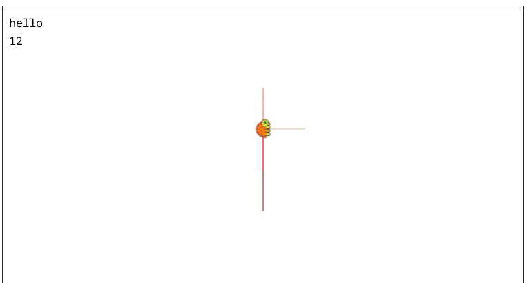

The turtle can draw in different 15 colors.The command for changing the pen's color is **setcolor** followed by the color's number.For example: **setcolor** 15

We can use the command box to print messages.The command is **print SOMETHING** (the SOMETHING represents whichever word you'd like to print in you message). For example: the command **print "pickaboo** will print the word 'pickaboo' in the command box.

The logo turtle has the ability to choose random numbers. The command is **random** followed by a number. The number indicated the range between 0 and that number.The command **random SOMETHING** will make the turtle pick a random number between 0 and SOMETHING -1. For example: the command **random 15** will show you a number between 0 and 14. If you want to the turtle to show you a random number he picked, yoו can command him to print a random number. You should type: **print random SOMETHING**



```

setcolor 8 fd 50
print "hello
print random 16
setcolor random 16 fd 50
to logocolor setcolor random 16 end
repeat 4 [logocolor fd 50 rt 90]

```