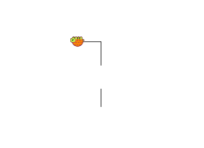

The command for lifting the pen is **penup**.

To put the pen back down on the drawing board using the command **pendown**.

The command for the turtle to hide is **hideturtle**.

To show up again we use the command **showturtle**.

Shortcuts:

penup -> pu

pendown -> pd

hideturtle -> ht

showturtle -> st




```

fd 30 pu fd 40 pd fd 40 ht lt 90 fd 40 st

```