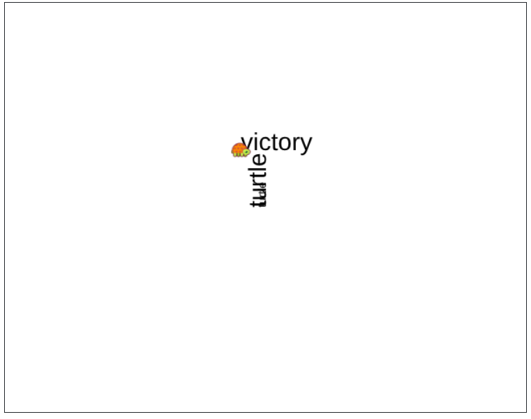

The label command is: **label TEXT**. Typing this will take the TEXT (a string) and print it on the screen in the direction in which the turtle is heading.

We can control the font of our label. The command is: **setlabelheight NUMBER**, where NUMBER should be a positive number representing the font size.





```

label "turtle
setlabelheight 30
label "turtle
seth 90 label "turtle
penup setxy -30 70 pendown seth 90 label "victory

```