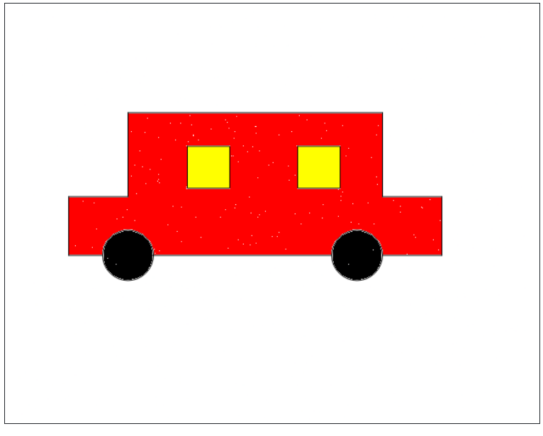

```

to windo :size :color filled :color [repeat 4 [fd :size rt 90]] end
to wheel :radius :color arc 360 :radius setcolor :color fill end
to car cs pu setxy 130 -50 pd rt 90 fd 70 lt 90 fd 70 lt 90 fd 70 rt 90 fd 100 lt 90 fd 300 lt 90 fd 100 rt 90 fd 70 lt 90 fd 70 lt 90 fd 40 pu fd 30 pd wheel 30 "black fd 240 pu fd 30 pd wheel 30 "black pu setxy 30 80 pd windo 50 "yellow setcolor "black pu setx -100 pd windo 50 "yellow setcolor "black ht end
car
pu lt 180 fd 20 set color "red fill

```