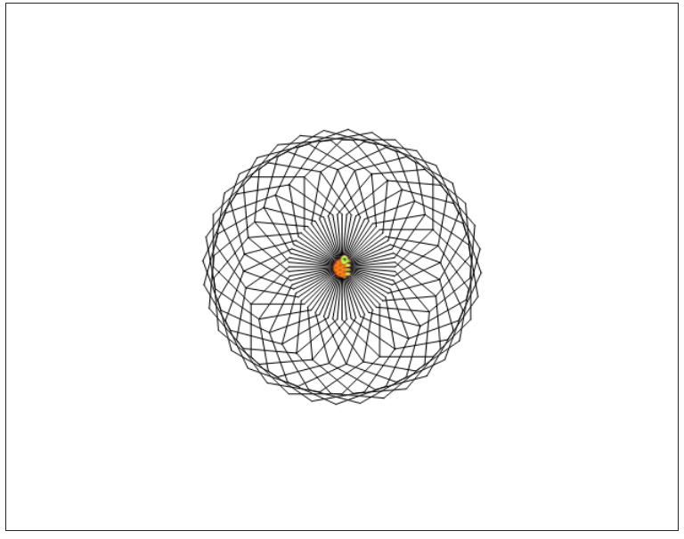

Logo offers the possibility of repeating a list of commands with the use of square brackets. For example, the square you drew before can also be drawn like this:  **`repeat 4 [ fd 50 lt 90]`** The number that follows the **repeat** command represents how many times the command sequence (command list) should be repeated. The command **repeat** together with the whole command sequence that we choose to repeat is called a loop.

We can even use a loop within a loop. A loop inside another loop is called a nested loop. You can picture the nested loop as a loop that is sitting in a bird's nest of the mother loop. Like this: Command `[mama loop [baby loop]]`.

The command **back** is pretty similar to **forward**. The shorthand for the command to go back is **bk**




```

fd 50 lt 90 fd 50 lt 90 fd 50 lt 90 fd 50 lt 90
repeat 4 [ fd 100 lt 90]
setxy 0 0 repeat 8 [ fd 70 lt 45 ]
cs
repeat 9 [repeat 4 [fd 5 rt 90] penup fd 8 pendown]
cs fd 100 bk 100
repeat 20 [ fd 80 bk 80 rt 18]
cs repeat 36 [ rt 10 repeat 8 [ fd 50 lt 45]]

```