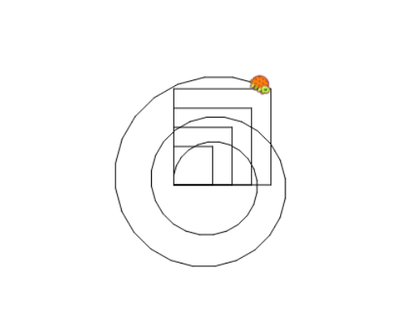

In the lesson "The turtle is Learning" we saw how we can teach the turtle new words by using the command **to** We can also teach the turtle a new command using **to** followed by a parameter, such as - **to** advance **:PARAM_NAME** fd **:PARAM_NAME**. The turtle will now expect to receive a param (a value) after he gets the new "advance" command. For example: advance 40.

When a command calls itself, that process is named 'recursion' When using recursion we must have a stopping condition (we don';t want to have an infinite loop) and a call for a command with new parameters.Sound complicated? Not to worry, we will go over it step by step. Let's teach the turtle the 'square' command by using recursion.



```

to advance :thesize fd :thesize end
to square :size repeat 4 [ fd :size rt 90] end
square 100
to square :size if :size > 90 [stop] repeat 4 [ fd :size rt 90] square :size + 20 end
square 40
to spiral :size if :size > 30 [stop] fd :size rt 15 spiral :size *1.02 end
spiral 10

```