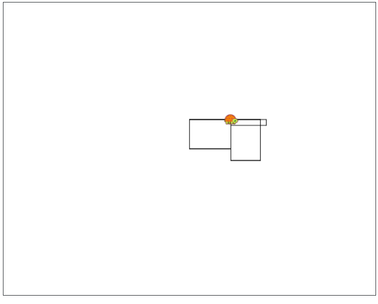

```

fd 50 rt 90 fd 70 rt 90 fd 50 rt 90 fd 70 rt 90
repeat 2 [fd 50 rt 90 fd 70 rt 90]
Make "w 50 Make "L 70
repeat 2 [fd :W rt 90 fd :L rt 90]
to rec :W :L repeat 2 [fd :W rt 90 fd :L rt 90] end
rec 60 10

```