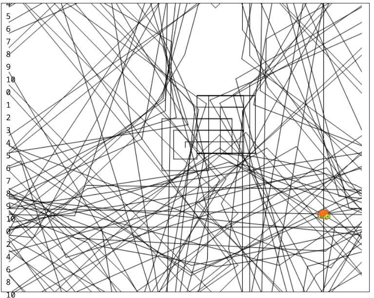

The **for** definition is as follow. **``for [var_name var_initial_value var_last_value advance] [command sequence ]``**. Let's start by showing an example. ``for [i 1 10 1] [print :i]`` .Our var_name here is i his initial value set to 1. we basically say to the sequence of command till i>10 , for each sequence the value of i will increase in 1(the third number). First time i=1 we are printing his value so 1 is printed . in the second time i=2 (why?)



```

for [i 1 10 1] [print :i]
for [i 0 10 2] [print :i]
for [i 10 100 10] [fd :i rt 90]
for [i 20 100 20] [repeat 4 [fd :i lt 90]]
for [i 1 100] [fd :i * 10 rt :i]

```