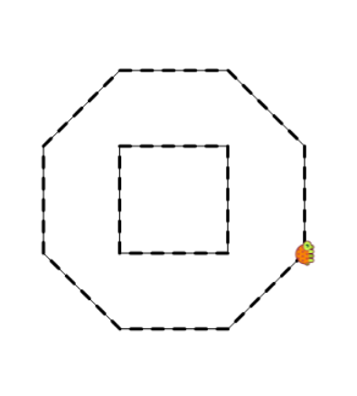

Until now you have been using a pen that draws a black line the width of 1 point. The width of the line means how thick the line is. If we want to draw more beautiful things, sometimes we'll want to use a wider or narrower line, or choose a different color. The command to change the pen's width is **setwidth** followed by a number. The number will represent the new width of the line, counting it in points.




```

setwidth 5
fd 50
setwidth 10 fd 60
lt 135
repeat 1 [repeat 5 [setwidth 3 fd 10] repeat 5 [setwidth 1 fd 10]]
repeat 5 [setwidth 1 fd 10 setwidth 3 fd 10]
cs repeat 4 [repeat 5 [setwidth 1 fd 10 setwidth 3 fd 10] lt 90]
repeat 8 [repeat 5 [setwidth 1 fd 10 setwidth 3 fd 10] lt 45]
cs repeat 4 [ repeat 5 [setwidth 1 fd 10 setwidth 3 fd 10] lt 90] rt 90 penup fd 71 lt 90 pendown repeat 8 [ repeat 5 [setwidth 1 fd 10 setwidth 3 fd 10] lt 45 ]

```