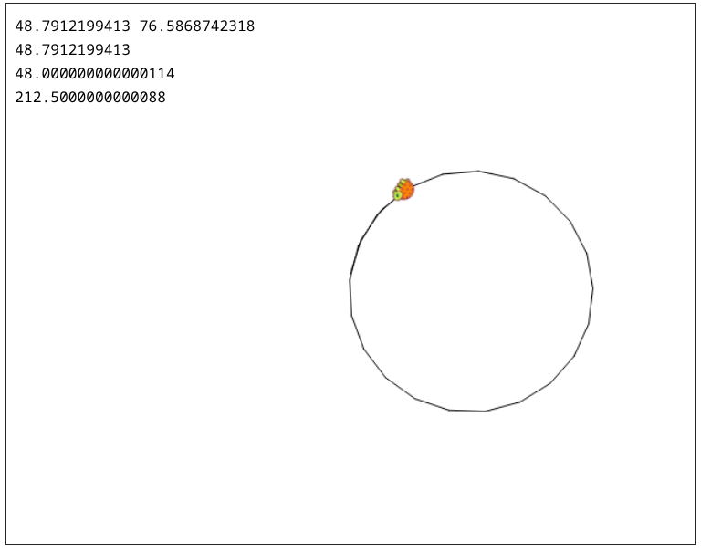

We will also use the command **pos** for position. The answer will appear as x- and y-coordinates.

Now we know how to ask the turtle for his x- and y-coordinates. If we choose so, we can ask him for only one of the coordinates, using **xcor** or **ycor**, respectively.

To know the exact direction (angle) the turtle is heading to, we can use the **heading** command.

So far we know our location and the direction where we are currently heading. Suppose we want to get to some specific point such as (0,0). We should know how to set the turtle head towards the point. The first thing we have to do is find the direction / angle in which we have to turn to get to the specified point. The command will be: **towards list XCOR YCOR**, where **XCOR** and **YCOR** are the point’s x- and y- coordinates respectively. The answer will be an absolute angle based on the 360 degrees of a circle.




```

cs repeat 24 [ rt 17 fd 33 ]
print pos
print xcor
print heading
print towards list 0 0
seth 212.5
```
