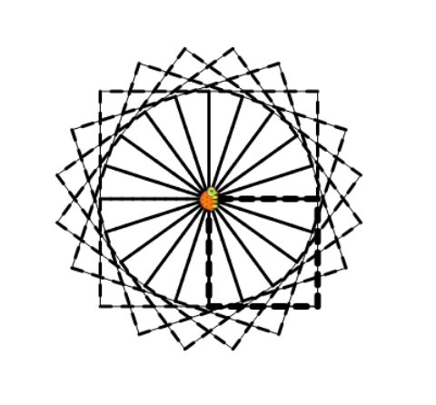

Teaching the turtle is simple. Write the command **to** followed by the word you want to teach the turtle and at the end write the line of commands for the turtle to learn. For example : **``to dashline repeat 5 [setwidth 1 fd 10 setwidth 3 fd 10] end``**. This command will teach the turtle a new word: dashline. (dashline = create a dashed line).



```

to dashline repeat 5 [setwidth 1 fd 10 setwidth 3 fd 10] end
dashline
repeat 4 [rt 90 dashline]
to square repeat 4 [rt 90 dashline] end
cs square
cs repeat 20[rt 18 square]
to dashline repeat 5 [setwidth 1 fd 10 setwidth 6 fd 10] end
square

```