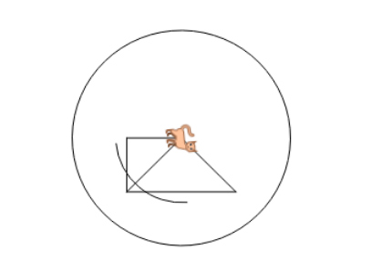

The turtle world is made of an x-axis and y-axis, where the x-axis is taken to be horizontal and the y-axis is taken to be vertical. When starting a program the turtle will stand on the (0,0) point. This means the horizontal value (x) is 0 and the vertical value (y) is 0. If we will tell the turtle to move fd 50 the turtle will stand on the point (0,50).

We already saw that the (0,0) point is the center of the turtle's world. If we want to get the center point without cleaning the screen we can use the **home** command. Notice the turtle will draw a line showing how he went back home. If we want to prevent this line we can tell the turtle to lift the pen up (penup) and then go home and put the pen down.  
Move the turtle to the point (0,0) using the **home** command.

We can also use a Logo command in order to set the turtle's x and y coordinates. The commands are **setx NUMBER** and **sety NUMBER** respectively, where NUMBER can be any numeral.

We already saw how we can use the **setx** and **sety** commands. We can combine these into one command using **setxy NUMBER-X NUMBER-Y**

If you imagine the small tip of the turtle triangle is his head, we can know in which direction he is heading. We can also command the turtle to face in any absolute direction based on the 360 degrees of a circle. Note that when we command the turtle to turn **rt 90** we are moving the turtle head 90 degrees clockwise. Commanding the turtle to turn **left 90** moves its head 90 degrees counterclockwise. If we want the head to point in the direction of a specific absolute angle, we should use the command **setheading NUMBER** (shortcut: **seth NUMBER**), where NUMBER is the number between 0-360 representing the angle direction in which we want our turtle head to point. To see how this works, first type **rt 45** followed by **rt 90**. Next, type **seth 45** and **seth 90** to see the difference.

The command for creating an arc is: **arc ANGLE RADIUS**, where ANGLE is a number between 0-360 representing the angle that will be covered the turtle rotates his position. RADIUS is the distance of the arc from the turtle’s head.

We do have an option to choose another shape for the turtle (which will actually make him a different animal).  
Using the command **changeshape** or **csh** with the animal name or id.  
**csh "dog** will change the turtle to a dog while **csh 3** will do exactly the same.  
Change the turtle into a cat using "STR



```

fd 50 setx 50 home setx 100 setxy 50 50 seth 175 arc 90 60 arc 360 100 csh "cat 

```